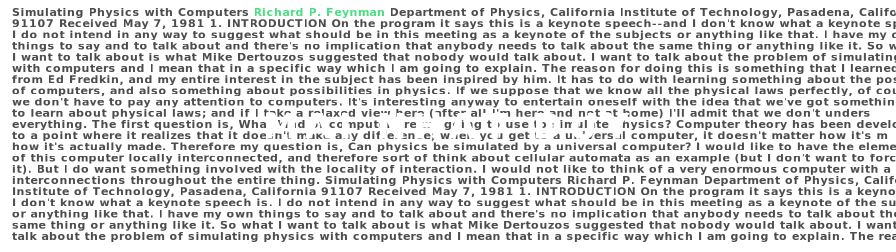

 

  

 

 

## About Me

I'm an **AI Engineer & NLP Researcher** based in Vietnam, passionate about pushing the boundaries of language model research. Currently interning at **QUAVEO** and serving as a Research Assistant at **TDTU NLP-KD Lab**.

- **Research Focus**: LLM fine-tuning · Discrete Diffusion LMs · Agentic RAG architectures
- **Specialization**: Vietnamese NLP — building language technology for underrepresented languages
- **Education**: Computer Science @ Tôn Đức Thắng University (TDTU)
- **Award**: Consolation Prize — Southern Region Student AI Olympiad 2025
- **Languages**: Vietnamese (Native) · English (CEFR B2)

## Tech Stack

  

 

### AI / ML Research

### Agents & Orchestration

### Infrastructure & Tools

